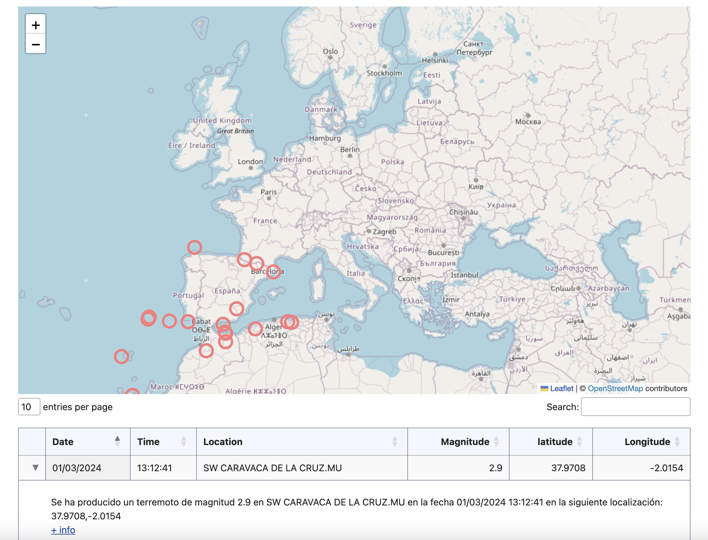

## Earthquakes Map
PHP website that shows a map with the points of Spain where earthquakes have occurred in the last ten days.

Earthquake information comes from the xml file: http://www.ign.es/ign/RssTools/sismologia.xml

The SimpleXML extension provides a very simple and easily usable toolset to convert XML to an object that can be processed with normal property selectors and array iterators.
[SimpleXML](https://www.php.net/manual/en/book.simplexml.php)

### *DataTable* option ###
Results are showing in a table as well
The tabla is generate by **datatable.js**
It's allowed the move the column order, clicking the row shows more information and finally the results are paginated.

you can see more information [here](https://datatables.net/manual/)
